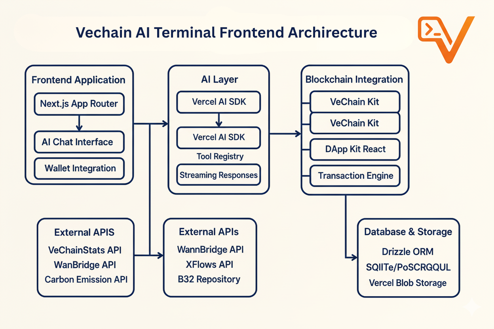
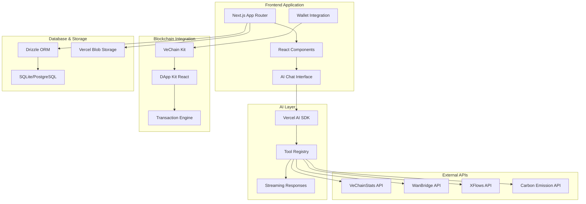

# VeChain AI Terminal ~ Frontend


**Stop visiting websites. Start talking to VeChain Ai Terminal.**
Can't stop
Remember when we used to open apps for everything? Now we just talk to AI. We're bringing this same revolution to blockchain - making VeChain operations as simple as I 

#### THIS IS THE INTERFACE FOR THE POST-WEBSITE ERA .

## Overview

**64+ operations. 25+ bridge destinations. 1 conversation.**

VeChain's ecosystem is exploding with innovation - but users are drowning in interfaces. We solved it by making blockchain operations as simple as sending a text message. This isn't just another blockchain tool - it's the interface for the post-website era.

**We've built what everyone else is promising:**
- 64+ live blockchain operations (not promises)
- Bridge to 25+ chains through conversation
- Real-time AI streaming with live blockchain data
- Plugin ecosystem like ChatGPT for blockchain

## Architecture Frontend 





## System Components

### Frontend Framework
- **Next.js 15**: React framework with App Router for modern web development
- **TypeScript**: Type-safe development with comprehensive type definitions
- **Tailwind CSS**: Utility-first styling with responsive design patterns
- **Framer Motion**: Advanced animations and interactive transitions

### AI Integration
- **Vercel AI SDK**: Streaming AI responses with tool calling capabilities
- **OpenAI Integration**: GPT models fine-tuned for VeChain blockchain context
- **Tool System**: 60+ blockchain tools including staking, bridge, and analytics operations
- **Real-time Streaming**: Live AI responses with progressive data loading

### Blockchain Connectivity
- **VeChain Kit**: Official VeChain wallet integration and transaction handling
- **DApp Kit React**: React hooks for seamless wallet connectivity
- **Transaction Engine**: Automated transaction creation, signing, and broadcasting
- **Multi-Network Support**: Testnet and Mainnet compatibility

## Features

### AI-Powered Interactions
- **Natural Language Processing**: Convert conversational commands to blockchain operations
- **Context-Aware Responses**: AI understands VeChain ecosystem terminology and concepts
- **Tool Execution**: Automated execution of blockchain operations through AI tools
- **Progressive Loading**: Real-time streaming of AI responses and blockchain data

### Blockchain Operations
- **Token Management**: VET, VTHO, and VIP-180 token operations with real-time balances
- **Smart Contract Interaction**: Dynamic contract calls with ABI resolution
- **StarGate Staking**: VET staking for NFT rewards with automated maturity tracking
- **Transaction Monitoring**: Real-time transaction status tracking and confirmation
- **Gas Optimization**: Automatic fee estimation and optimization strategies

### Cross-Chain Capabilities
- **WanBridge Integration**: Secure asset transfers to 25+ blockchain networks
- **XFlows Support**: Advanced cross-chain swap protocols with optimal routing
- **Bridge Monitoring**: Real-time tracking of cross-chain transaction status
- **Multi-Chain Analytics**: Comprehensive data across connected networks

### Data Analytics
- **Real-Time Blockchain Data**: Live network statistics and transaction monitoring
- **Carbon Footprint Tracking**: Environmental impact analysis for blockchain operations
- **Historical Analytics**: Comprehensive transaction and balance history
- **Market Data Integration**: Real-time token prices and market information

## External API Integrations

### **VeChainStats API**
Comprehensive blockchain analytics providing real-time network statistics, token information, transaction history, and market data. Powers the data layer for all blockchain insights and analytics features.

### **WanBridge API**
Cross-chain bridge operations enabling secure asset transfers between VeChain and 25+ destination blockchains including Ethereum, Polygon, BSC, and more. Handles automated transaction routing and fee optimization.

### **XFlows API**
Advanced cross-chain swap protocols with intelligent routing algorithms for optimal transaction paths across multiple blockchain networks. Provides automated slippage protection and MEV resistance.

### **Carbon Emission APIs**
Environmental impact tracking for blockchain operations, providing carbon footprint calculations for transactions, smart contract interactions, and network participation.

### **StarGate API**
VET staking protocol integration enabling NFT-based staking rewards across six tier levels (Dawn through Mjolnir). Handles stake creation, VTHO reward tracking, maturity monitoring, and automated unstaking operations with X-Series instant liquidity support.

## Technology Stack

### Core Framework
- **Next.js 15**: Modern React framework with App Router architecture
- **React 19 RC**: Latest React features with concurrent rendering
- **TypeScript 5.6**: Enhanced type safety and developer experience
- **Tailwind CSS 3.4**: Responsive utility-first styling system

### AI & Data Processing
- **Vercel AI SDK 5.0**: Advanced AI integration with streaming capabilities
- **OpenAI GPT**: Fine-tuned models for blockchain domain expertise
- **Streaming APIs**: Real-time data processing and response generation
- **Tool Registry**: Modular system for blockchain operation tools

### Blockchain Integration
- **VeChain Kit 2.0**: Official VeChain wallet integration
- **DApp Kit React 2.0**: React hooks for blockchain connectivity
- **VeChain SDK**: Low-level blockchain interaction capabilities
- **Multi-Network Support**: Testnet and mainnet compatibility

### Database & Storage
- **Drizzle ORM 0.34**: Type-safe database operations
- **Better SQLite3**: High-performance local database
- **Vercel Postgres**: Scalable cloud database option
- **Vercel Blob Storage**: File and asset management

### Development Tools
- **Biome**: Fast code formatting and linting
- **Playwright**: End-to-end testing framework
- **ESLint**: Code quality and consistency
- **Vercel Analytics**: Performance monitoring and insights

## Quick Start

### Prerequisites
- Node.js 18 or higher
- pnpm package manager
- VeChain wallet (VeWorld, Sync2, or compatible)
- Environment variables configured

### Installation

1. **Clone and install dependencies**
   ```bash
   git clone https://github.com/VeChain-AI-Terminal/vechain-terminal-frontend
   cd vechain-terminal-frontend
   pnpm install
   ```

2. **Configure environment variables**
   ```bash
   cp .env.example .env.local
   ```
   Edit `.env.local` with your API keys and configuration:
   ```env
   VECHAINSTATS_API_KEY=your_vechainstats_api_key
   OPENAI_API_KEY=your_openai_api_key
   VECHAIN_NETWORK=testnet
   DATABASE_URL=your_database_url
   ```

3. **Initialize database**
   ```bash
   pnpm db:generate
   pnpm db:migrate
   ```

4. **Start development server**
   ```bash
   pnpm dev
   ```
   
   The application will be available at `http://localhost:3000`

### Database Management

```bash
# Generate database migrations
pnpm db:generate

# Run migrations
pnpm db:migrate

# Open database studio
pnpm db:studio

# Push schema changes
pnpm db:push
```

## Usage Examples

### Token Operations
```
"Check my VET and VTHO balance"
"Transfer 100 VET to 0x742d35Cc6651Fb66D8dD9b2a5D35bfa2F9d2E7c7"
"Show me all VIP-180 tokens in my wallet"
"Get the current VET price and market cap"
```

### Smart Contract Interactions
```
"Verify the contract at 0x0000000000000000000000000000456E65726779"
"Show me the contract code for the VTHO token"
"Get contract statistics for the last 30 days"
```

### Cross-Chain Operations
```
"Bridge 500 VET to Ethereum using WanBridge"
"Check bridge fees for VET to Polygon"
"Show me my cross-chain transaction history"
```

### StarGate Staking Operations
```
"Show me all available StarGate staking levels"
"Stake 600,000 VET for a Dawn level StarGate NFT"
"Check my StarGate stakes and claimable VTHO rewards"
"Claim VTHO rewards from my Lightning StarGate NFT"
"Unstake my mature Flash level StarGate NFT"
```

### Analytics and Data
```
"Show me VeChain network statistics"
"What's my carbon footprint from blockchain transactions?"
"Get my transaction history for the last week"
"Analyze my NFT portfolio"
```

## Development

### Project Structure

```
src/
├── app/                    # Next.js App Router pages
├── components/             # React components
├── lib/
│   ├── ai/                # AI integration and tools
│   │   ├── tools/         # Blockchain operation tools
│   │   └── prompts.ts     # AI prompt engineering
│   ├── db/                # Database configuration
│   └── utils/             # Utility functions
├── styles/                # Global styles and themes
└── types/                 # TypeScript type definitions
```

### Adding New Tools

1. **Create tool file in `lib/ai/tools/`**
   ```typescript
   import { tool } from "ai";
   import z from "zod";

   export const customTool = tool({
     description: "Custom blockchain operation",
     inputSchema: z.object({
       address: z.string().describe("Target address")
     }),
     execute: async ({ address }) => {
       // Implementation
     }
   });
   ```

2. **Register tool in `app/(chat)/api/chat/route.ts`**
3. **Add appropriate prompts in `lib/ai/prompts.ts`**
4. **Update UI components in `components/message.tsx`**

### Testing

```bash
# Run development server
pnpm dev

# Type checking
pnpm typecheck

# Linting and formatting
pnpm lint
pnpm format

# End-to-end testing
pnpm test
```

## Security Considerations

### Wallet Security
- Client-side wallet integration with VeChain Kit
- No private key storage on servers
- Secure transaction signing through browser wallets
- Network isolation between testnet and mainnet

### API Security
- Environment variable protection for API keys
- Rate limiting on external API calls
- Input validation and sanitization
- HTTPS-only communication

### Application Security
- Content Security Policy implementation
- XSS protection through React's built-in safeguards
- SQL injection prevention with Drizzle ORM
- Secure session management

## Contributing

This project welcomes contributions for improving AI-blockchain integration patterns:

1. Fork the repository and create feature branches
2. Follow TypeScript and React best practices
3. Add comprehensive tests for new functionality
4. Update documentation for UI/UX changes
5. Submit pull requests with detailed descriptions

## License

MIT License - see LICENSE file for complete terms and conditions.

---

**VeChain AI Terminal** - Pioneering the post-website era where blockchain operations are as simple as conversation.